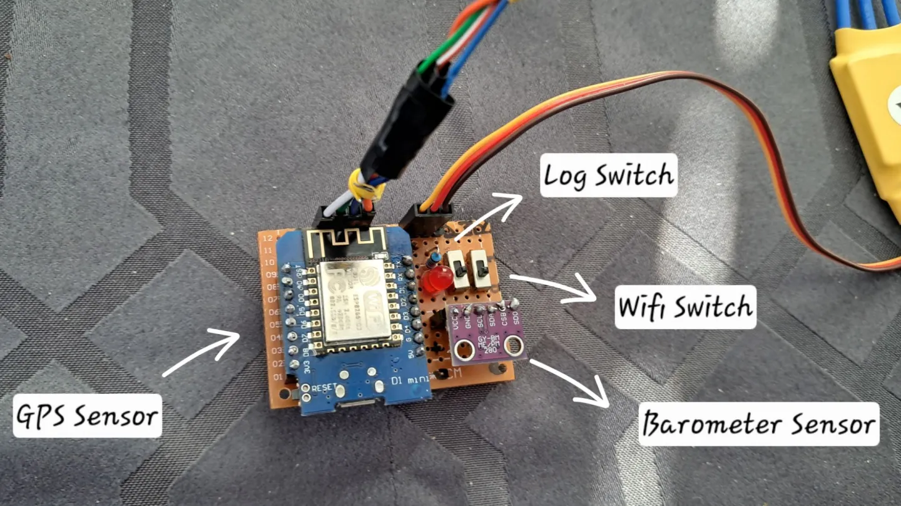

# RC Flight Tracker & Logger
A high-precision flight data logging system for RC aircraft built on the ESP8266. This device captures 3D flight paths by fusing GPS coordinates with barometric altitude data from a BMP280, then serves the data over a local WiFi portal.

# Features
* Dual-Sensor Data: High-accuracy horizontal GPS positioning paired with ±1 meter vertical precision via the BMP280 pressure sensor.
* Auto-KML Generation: Logs are saved directly in .kml format, ready to be dropped into Google Earth for 3D flight visualization.
* Wireless Data Access: Integrated Web Server allows you to download or delete flight logs from your smartphone at the field—no SD card removal required.
* Status Intelligence: LED signaling for GPS fix status, satellite count, and recording activity.

# How to Use
1. Recording a Flight
   1. Power on the device. The LED will flash rapidly while searching for a GPS fix.
   2. Once a fix is established (4+ satellites), the LED turns solid.
   3. Flip the Record Switch (D3). The LED will blink slowly, indicating the flight path is being saved to the internal LittleFS storage.
   4. Flip the switch back to stop recording and finalize the .kml file.

2. Retrieving Data
   1. Flip the WiFi Switch (D4).
   2. Connect your phone/laptop to the WiFi network: RC_FLIGHT_DATA (Password: 12345678).
   3. Navigate to 192.168.4.1 in your browser.
   4. Download your flight files and open them in Google Earth to analyze your flying patterns and level flight stability.

# Project Structure
* LittleFS: Used for robust on-chip file storage.
* TinyGPS++: Handles NMEA sentence parsing.
* Adafruit_BMP280: Manages altitude sensing relative to the takeoff point (baseline).
* ESP8266WebServer: Serves the mobile-friendly download portal.

# Project field trial pictures

